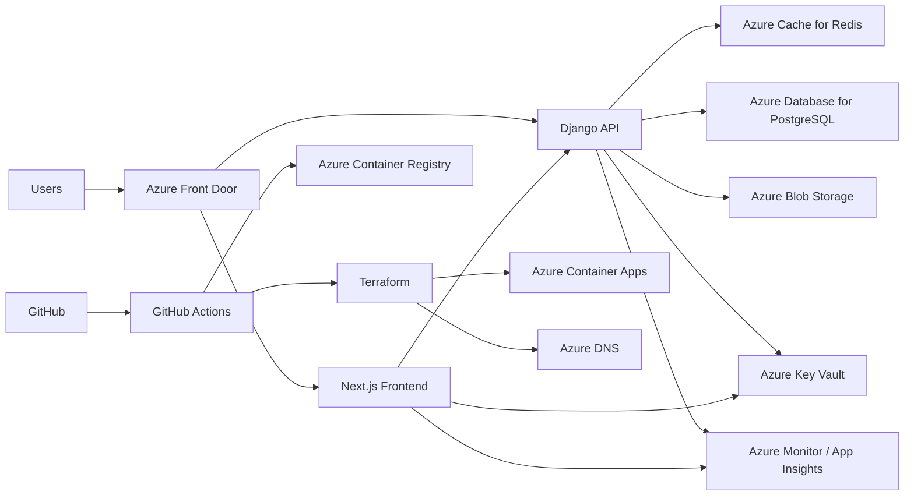

# MooreSkillUp Production DevOps Architecture

## Purpose

This document is the target production blueprint for MooreSkillUp. It describes the cloud, container, CI/CD, security, and operational structure we should build toward even if some pieces are still being implemented.

## 1. Repository Structure

- `backend/` — Django API, admin APIs, background jobs, tests, settings
- `src/` — Next.js frontend, UI, app routes, client data access
- `docs/` — architecture, deployment, operations, and runbooks
- `infrastructure/` — cloud and IaC structure
- `infrastructure/terraform/` — Terraform modules and environment definitions
- `scripts/` — release, backup, validation, and maintenance helpers
- `nginx/` — optional reverse-proxy configuration
- `.github/workflows/` — CI/CD pipelines
- `tests/` — end-to-end or cross-cutting integration tests

## 2. Target System Architecture

## 3. Platform Components

- **Azure Front Door** — global edge entry, TLS termination, routing, WAF, caching
- **Next.js frontend** — user interface and server-side rendering
- **Django API** — auth, courses, payments, notifications, admin, reporting
- **Redis** — session/cache/rate-limit/short-lived application data
- **PostgreSQL** — source of truth for users, courses, payments, audit, progress
- **Blob Storage** — media uploads, certificates, exports, backups, static assets if needed
- **Key Vault** — secrets, certificates, connection strings, API keys
- **Container Apps** — run frontend and backend containers independently
- **Container Registry** — store versioned images for frontend/backend
- **Monitor + App Insights** — logs, traces, metrics, alerts, dashboards
- **GitHub Actions** — lint, test, build, scan, package, deploy
- **Terraform** — reproducible infrastructure provisioning

## 4. Environment Layout

- **Development** — local Docker Compose, hot reload, console email, test data
- **Staging** — production-like Azure resources with safe sample data
- **Production** — locked-down Azure resources, secrets in Key Vault, alerts on

## 5. Terraform Layout

- `modules/resource_group`
- `modules/network`
- `modules/container_registry`
- `modules/container_apps`
- `modules/postgres`
- `modules/redis`
- `modules/storage`
- `modules/key_vault`
- `modules/monitoring`
- `modules/front_door`
- `modules/dns`
- `environments/dev`
- `environments/staging`
- `environments/prod`

## 6. CI/CD Design

1. PR opens
2. Lint, typecheck, tests, and build run
3. Security scans run
4. Images are built and pushed on main branch
5. Terraform plan is generated
6. Manual approval gates production deployment
7. Apply infrastructure changes
8. Deploy app containers
9. Run smoke tests and rollback automatically on failure

## 7. Docker Standards

- Multi-stage builds
- Small runtime images
- Non-root users where possible
- Health checks for every service
- Runtime config via environment variables
- No secrets baked into images

## 8. Django Production Requirements

- Gunicorn as the app server
- WhiteNoise or object storage for static assets
- Blob storage for media
- Redis-backed caching
- Session-aware JWT auth
- Structured logging
- Environment-based settings

## 9. Next.js Production Requirements

- Production build in the container
- Build-time public env vars
- No dev server in production
- Image optimization enabled
- Cache headers for static assets

## 10. Security Baseline

- Least privilege everywhere
- Managed identities where supported
- HTTP to HTTPS redirects
- Secure, HttpOnly cookies
- CORS locked to known frontends
- Image and dependency scanning
- Audit logging for admin actions

## 11. Monitoring and Recovery

- Health probes for both apps
- Error and latency dashboards
- Alerting for 5xx spikes and DB failures
- Daily database backups
- Blob retention policies
- Tested restore procedures

## 12. Roadmap

1. Stabilize Docker and env files
2. Create Terraform skeleton
3. Provision Azure dev/staging/prod
4. Deploy backend and frontend
5. Add CI/CD
6. Add monitoring and alerts
7. Add backup and recovery automation
8. Harden security and scale out

